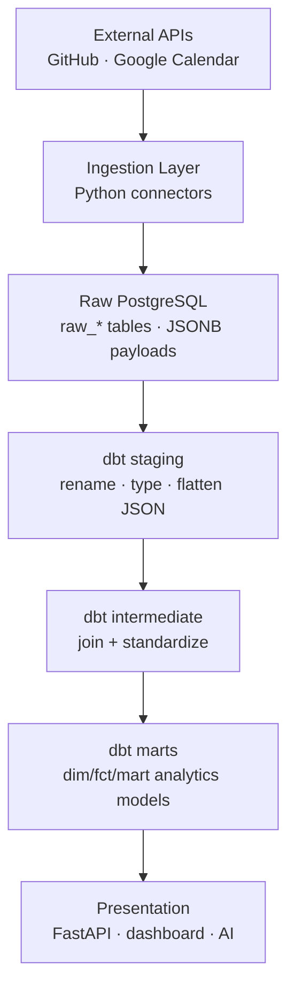
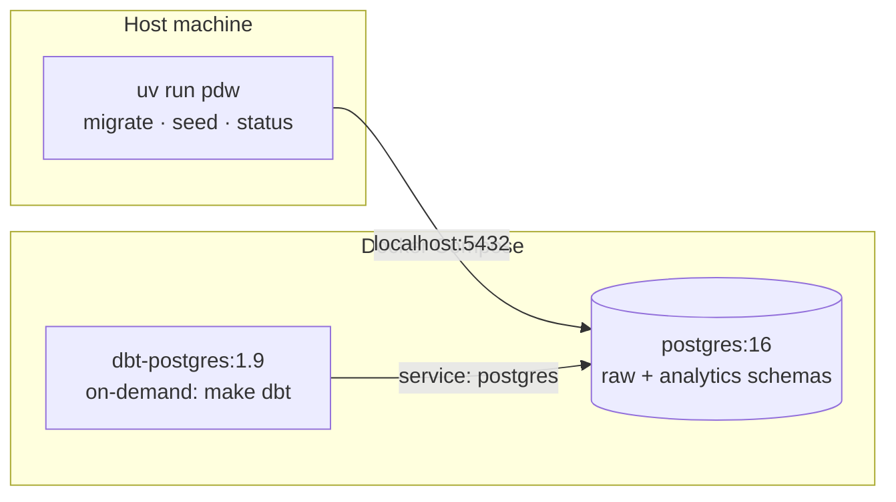

# Architecture

The Personal Data Warehouse is a local-first ELT system. External data is
ingested into a raw PostgreSQL layer with minimal transformation, then dbt
builds analytics-ready models on top. Layers are strictly separated (spec §2,
§33): ingestion never produces analytics tables, and analytics never call
external APIs.

## Layers

## Milestone status

This milestone delivers the **foundation**: PostgreSQL, raw schema, migrations,
a synthetic data generator that stands in for the ingestion layer, and the
full dbt transform path (staging → intermediate → marts + tests). The pipeline
runs end-to-end on synthetic data with no external credentials.

- **Done:** raw layer, migrations, synthetic generator, dbt models + tests.
- **Deferred:** real GitHub/Calendar connectors, Dagster orchestration, FastAPI,
  dashboard, AI layer, CI.

## Runtime layout (this milestone)

Ingestion runs locally via `uv` (Python 3.12) and connects to Postgres on
`localhost`. dbt runs in a container on the compose network and connects to the
`postgres` service name. Containerizing ingestion is deferred until Dagster +
real connectors land.

## Idempotency & incremental loading

- Raw tables enforce natural keys with unique constraints (spec §13):
  - GitHub repository: `(source, source_id)`
  - GitHub commit: `(source, source_id)`
  - Calendar event: `(source, calendar_id, source_id)`
- Loaders upsert via `ON CONFLICT … DO UPDATE`, so `make seed` / `make sync` are
  safe to run repeatedly without duplicating rows (spec §12, §13).
- `sync_state` records each connector's last successful sync cursor; the
  synthetic generator writes a checkpoint so `pdw status` reflects a run.

## Observability

Every run records a row in `pipeline_runs` (source, started/finished, status,
records fetched/inserted/updated/failed, error). `pdw status` reads this table.