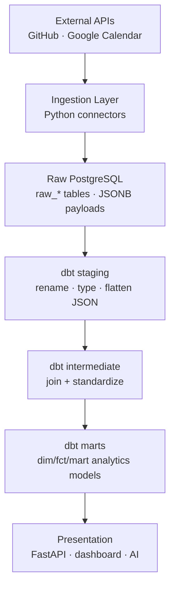
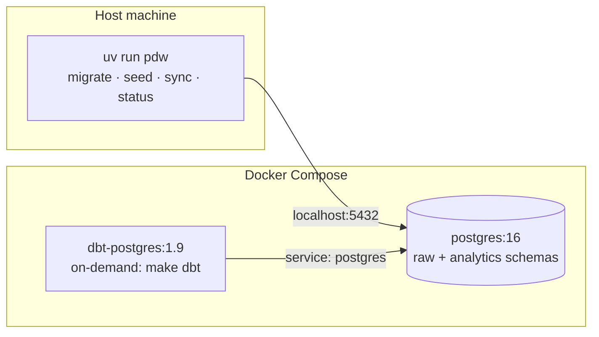

# Architecture

The Personal Data Warehouse is a local-first ELT system. External data is
ingested into a raw PostgreSQL layer with minimal transformation, then dbt
builds analytics-ready models on top. Layers are strictly separated (spec §2,
§33): ingestion never produces analytics tables, and analytics never call
external APIs.

## Layers



## Milestone status

The **foundation** plus **real connectors** are delivered: PostgreSQL, raw
schema, migrations, the full dbt transform path (staging → intermediate →
marts + tests), and real GitHub + Google Calendar connectors with incremental
+ idempotent ingestion. The pipeline runs end-to-end on synthetic data with no
external credentials, and on real data once credentials are added to `.env`.

- **Done:** raw layer, migrations, synthetic generator, dbt models + tests,
  real GitHub + Calendar connectors, per-entity incremental cursors, error
  handling (auth / rate-limit / partial failures), CLI `sync` group.
- **Deferred:** Dagster orchestration, FastAPI, dashboard, AI layer, CI.

## Runtime layout



Ingestion runs locally via `uv` (Python 3.12) and connects to Postgres on
`localhost`. dbt runs in a container on the compose network and connects to the
`postgres` service name. Containerizing ingestion is deferred until Dagster
lands.

## Connectors

```
connectors/base.py     exceptions, httpx wrapper (injectable client), retry
connectors/github.py   GitHubClient + GitHubConnector (repos + commits)
connectors/calendar.py GoogleTokenRefresher + CalendarClient + CalendarConnector
pipeline/loaders.py    source-agnostic upserts (shared with synthetic)
pipeline/checkpoints.py per-entity cursor get/set
pipeline/runner.py     run_github / run_calendar orchestration
```

The HTTP client is injectable, so tests pass a fake client (no network, no
extra test dependencies). Connectors never touch the database directly — the
runner fetches records and hands them to the shared loaders.

## Idempotency & incremental loading

- Raw tables enforce natural keys with unique constraints (spec §13):
  - GitHub repository: `(source, source_id)`
  - GitHub commit: `(source, source_id)`
  - Calendar event: `(source, calendar_id, source_id)`
- Loaders upsert via `ON CONFLICT … DO UPDATE`, so `make seed` / `make sync` /
  `make sync-real` are safe to run repeatedly without duplicating rows (spec §12,
  §13).
- `sync_state` records a per-entity cursor keyed by `(connector, entity_key)`:
  - GitHub: one cursor per repository (`entity_key = repo full_name`), advanced
    to the newest commit's `committed_at`.
  - Calendar: one cursor (`entity_key = 'primary'`) using `updatedMin`, which
    also surfaces cancellations.
  - The synthetic generator writes a single `('synthetic', 'all')` checkpoint.

## Observability

Every run records a row in `pipeline_runs` (source, started/finished, status,
records fetched/inserted/updated/failed, error). `pdw status` reads this table.